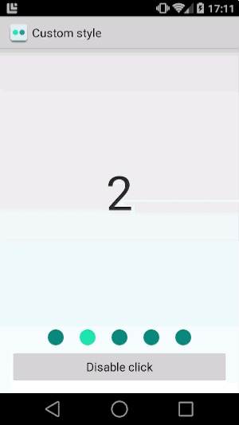

# Android-PageControl

[](https://travis-ci.org/ksoichiro/Android-PageControl)



Clickable PageControl for Android apps.  
There are some great libraries like `ViewPagerIndicator` but they don't handle taps on indicator like `PageControl` on iOS.  
This widget handles taps just as `PageControl` does.

## Usage

### build.gradle

Available in the Maven Central Repository.  
It depends on `support-v4` library.

```groovy
dependencies {
    compile 'com.android.support:support-v4:20.0.0'
    compile 'com.github.ksoichiro:androidpagecontrol:0.1.0'
}
```

### Add to layout XML

```xml
    <com.androidpagecontrol.PageControl
        android:id="@+id/page_control"
        android:layout_width="match_parent"
        android:layout_height="wrap_content" />

    <android.support.v4.view.ViewPager
        android:id="@+id/pager"
        android:layout_width="match_parent"
        android:layout_height="match_parent"
        android:layout_above="@id/page_control"
        android:layout_alignParentTop="true" />
```

### Add Java codes

```java
SamplePagerAdapter adapter = new SamplePagerAdapter(this);
ViewPager viewPager = (ViewPager) findViewById(R.id.pager);
viewPager.setAdapter(adapter);

final PageControl pageControl = (PageControl) findViewById(R.id.page_control);
pageControl.setViewPager(viewPager);
pageControl.setPosition(1);
```

### Styling

```xml
    <style name="AppTheme" parent="AppBaseTheme">
        <item name="apcStyles">@style/AppPageControlStyle</item>
    </style>

    <style name="AppPageControlStyle">
        <!-- To change indicator size -->
        <item name="apc_indicatorSize">8dp</item>
        <!-- To change distance between indicators -->
        <item name="apc_indicatorDistance">8dp</item>
        <!-- To change current item indicator size -->
        <item name="apc_currentIndicatorSize">10dp</item>
        <!-- To change indicator colors -->
        <item name="apc_colorCurrentDefault">#1de9b6</item>
        <item name="apc_colorCurrentPressed">#a7ffeb</item>
        <item name="apc_colorNormalDefault">#009688</item>
        <item name="apc_colorNormalPressed">#4db6ac</item>
    </style>
```

### Controlling enable/clickable

`PageControl`'s `setEnable(boolean)` and `setClickable(boolean)` methods affect to its children(indicators).
So if you want to disable taps for indicators, you don't have to access each indicator views.

## Developed By

* Soichiro Kashima - <soichiro.kashima@gmail.com>

## License

    Copyright 2014 Soichiro Kashima

    Licensed under the Apache License, Version 2.0 (the "License");
    you may not use this file except in compliance with the License.
    You may obtain a copy of the License at

        http://www.apache.org/licenses/LICENSE-2.0

    Unless required by applicable law or agreed to in writing, software
    distributed under the License is distributed on an "AS IS" BASIS,
    WITHOUT WARRANTIES OR CONDITIONS OF ANY KIND, either express or implied.
    See the License for the specific language governing permissions and
    limitations under the License.

[Publishing script](kotlin-publish.gradle) is based on [chrisbanes/gradle-mvn-push](https://github.com/chrisbanes/gradle-mvn-push).

    Copyright 2013 Chris Banes

    Licensed under the Apache License, Version 2.0 (the "License");
    you may not use this file except in compliance with the License.
    You may obtain a copy of the License at

       http://www.apache.org/licenses/LICENSE-2.0

    Unless required by applicable law or agreed to in writing, software
    distributed under the License is distributed on an "AS IS" BASIS,
    WITHOUT WARRANTIES OR CONDITIONS OF ANY KIND, either express or implied.
    See the License for the specific language governing permissions and
    limitations under the License.
